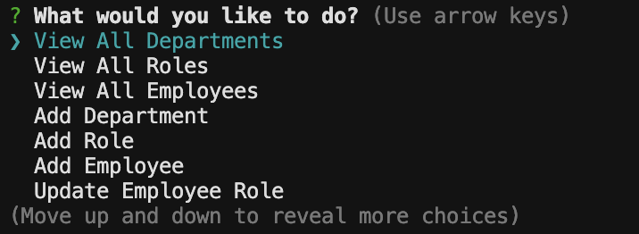
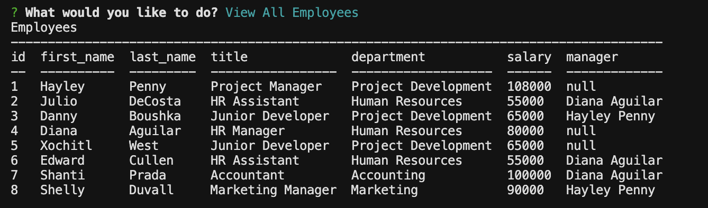
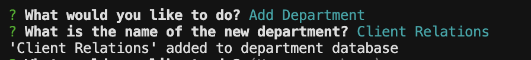
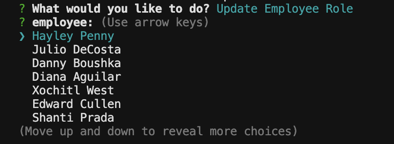
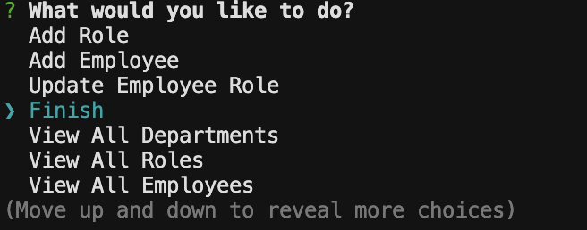

# SQL Employee Tracker 

  

  ## Description

  This Project was created to allow an employer to easily track their departments, roles and salaries, and employees and managers. This was accomplished by creating a command-line application from scratch to manage a company's employee database, using Node.js, Inquirer, and MySQL. This project challenged me to integrate MySQL queries with Inquirer prompts to not only show the tables from the MySQL database within the Inquirer prompts, but to also use the responses to the prompts to perform INSERT and UPDATE queries on the database. The hardest part of this process was identifying each employee's manager and returning them at the end of the employee table when the user selects 'View All Employees'.

  ## Table of Contents

  - [Installation](#installation)
  - [Usage](#usage)
  - [License](#license)

  ## Installation

  To install this application, copy the code from https://github.com/boushka9/abstract-lego-art and type 'npm run start' into the terminal of the cloned code.

  ## Usage

  Walkthrough video: https://drive.google.com/file/d/1hmu806ylmPsvlZsuCfZ5Mc8xlr5f9CCk/view?usp=share_link

  After typing 'npm run start' users will see a navigation menu with the different actions they can take with regards to the database.

  

  The First three options, 'View All Departments', 'View All Roles', and 'View All Employees', allow the user to view the corresponding table which includes the department names and ID's, the role titles, salaries, and corresponding departments, and the employee's name, role, and manager. 

  

  The next three options of the navigation menu, 'Add Department', 'Add Role', and 'Add Employee', allow the user to insert new data into each table of the database. Users can insert new department names, add new roles and salaries along with what department they belong to, and add new employees along with their role and manager.

  

  The final option of the navigation menu is to 'Update Employee Role', which can be used to change an employee's role within the company.

  

  After each prompt has been answered or the correct table shown, the navigation menu will appear again to allow the user to make addition selections. Once the user has made all of their desired changes they can simply navigate to the last option of the menu and select 'Finish' to exit the application. 

  

  ## License

  This project is licensed under the terms of the MIT license 

  ---

  ## Badges

    
  
  
  

  ## Questions

  If you have any questions regarding this application please contact me through email or GitHub:

  boushka9@gmail.com

  boushka9

  